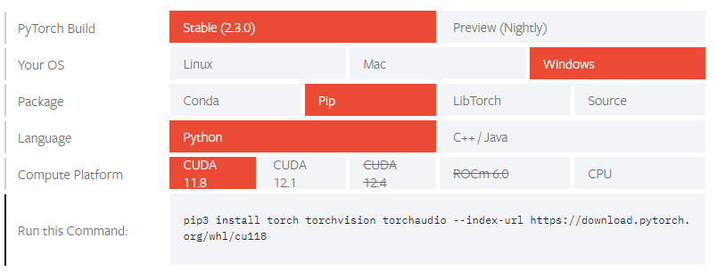

# CryptidLlama
An encrypted AI chat in Python.

## Installation
First, clone the project from the GitHub repository:
```bash
git clone https://github.com/F8teTrue/CryptidLlama.git
```
### Obtaining the AI model
**You will need to download [Meta-Llama/Llama-2-7b-chat-hf](https://huggingface.co/meta-llama/Llama-2-7b-chat-hf) from Hugging Face. For this you need to gain access to the model. To do this you need to send a request on Meta's website [here](https://llama.meta.com/llama-downloads/) to download their models. Then create a Hugging Face account with the same e-mail and then submit a request to use the model. You will also need to create a read access token in your Hugging Face profile.**

**This is a rather large model that needs some very good hardware to run best. You can also use another model, but you will need to modify the code for the host/server. You can find models on [Hugging Face](https://huggingface.co/models)**

When granted access to the model you can follow these steps to download it:

Go into to models folder in the terminal and do the following commands.
```bash
git lfs install
```
then clone the model into the folder
```bash
git clone https://huggingface.co/meta-llama/Llama-2-7b-chat-hf
```
This download can take a while.

## Pip installations
**This project was created using python 3.11**

For both server and client:
* RSA for encrypting AES key.
```bash
pip install rsa
```
* AES for encrypting prompts and responses.
```bash
pip install PyCryptodome
```
* Colorama for a better user interface in the terminal.
```bash
pip install colorama
```
For server only:
* Transformers (for the AI model).
```bash
pip install Transformers
```
* Torch

Go to [Torch website](https://pytorch.org/get-started/locally/) to download torch for your system.
You will need to select **CUDA** as compute platform to run the model on the GPU.



# Usage
Open up the repository folder in a terminal or PowerShell window.
```
cd path/to/folder
```
To run host (You might not need the 3.11):
```bash
python3.11 host.py
```
To run client:
```bash
python3.11 client.py
```
You will also need to specify the server's IP in the code for client

**Before you can send in a prompt as client you will have to wait for the message that says "Server is ready."**

# License
[LICENSE](LICENSE)
